# NETWORKWALKS Cybersecurity Internship - Batch B083

## Week 3 - Password Cracking with John the Ripper & Networkwalks Tools

**Intern:** Tsholele Phoofolo
**Batch:** B083
**Week:** 3
**Project:** PM1, PM2 - Password Cracking
**Date:** September 2026

---

## Project Overview

Week 3 focused on **password cracking** — the process of recovering a password from stored data or a protected file. The goal was to demonstrate how weak passwords can be compromised quickly, and why strong password policies matter.

Two modules were completed:

- **PM1** — Password Cracking with John the Ripper (JTR) and Johnny (JTR GUI) on Windows
- **PM2** — Password Cracking with Networkwalks web tools (Hash Calculator + Password Cracker)

Both targeted the same password-protected PDF file (`My Locked PDF1.pdf`).

---

## Tools Used

| Tool | Purpose | Platform |
|------|---------|----------|
| John the Ripper (JTR) | Password cracking engine | Windows |
| Johnny | GUI for JTR | Windows |
| Networkwalks Hash Calculator | Extract `$pdf$` hash | Browser |
| Networkwalks Password Cracker | Dictionary attack | Browser |
| Notepad | Save extracted hash | Windows |

---

## PM1 - Password Cracking with JTR & Johnny

### Installation
- Extracted Johnny ZIP and installed Johnny GUI
- Extracted JTR jumbo bundle to Desktop
- Connected Johnny to `run\john.exe`

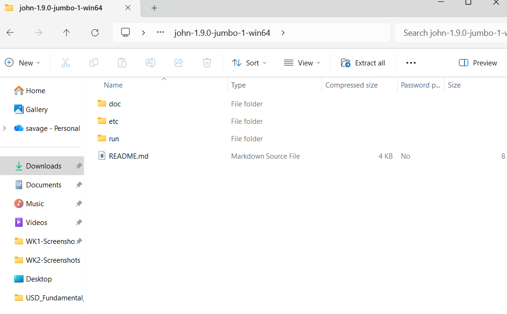

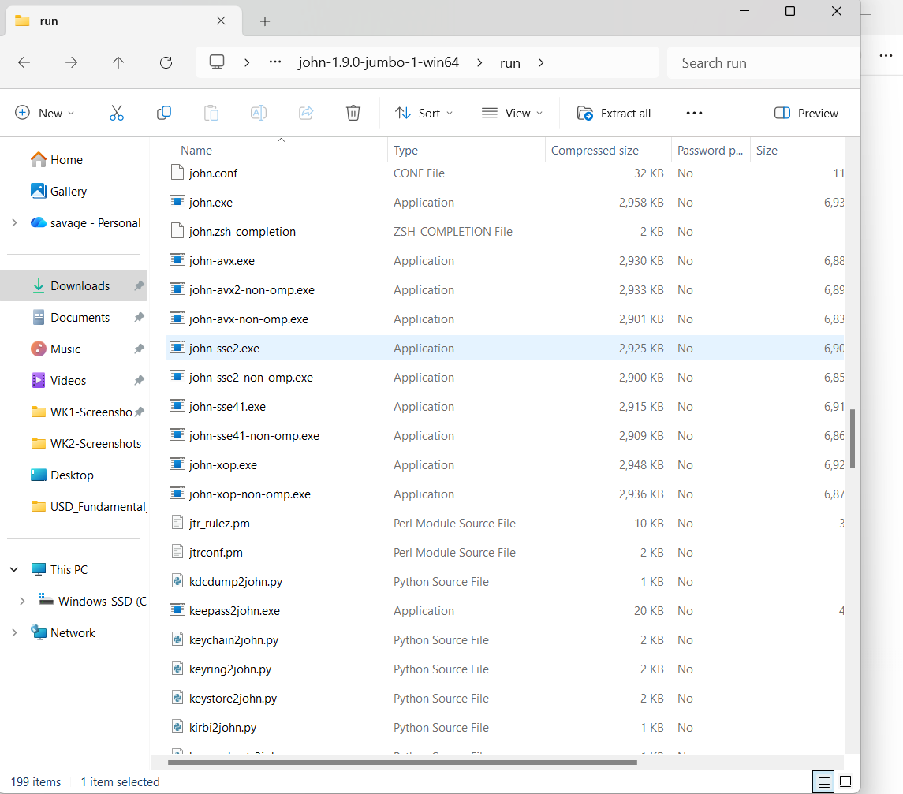

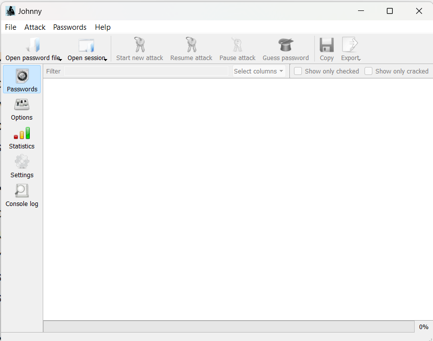

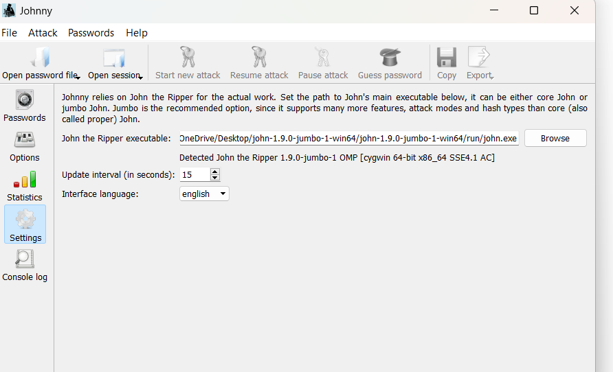

### Hash Extraction
Uploaded `My Locked PDF1.pdf` to Networkwalks Hash Calculator to extract the crackable `$pdf$` hash.

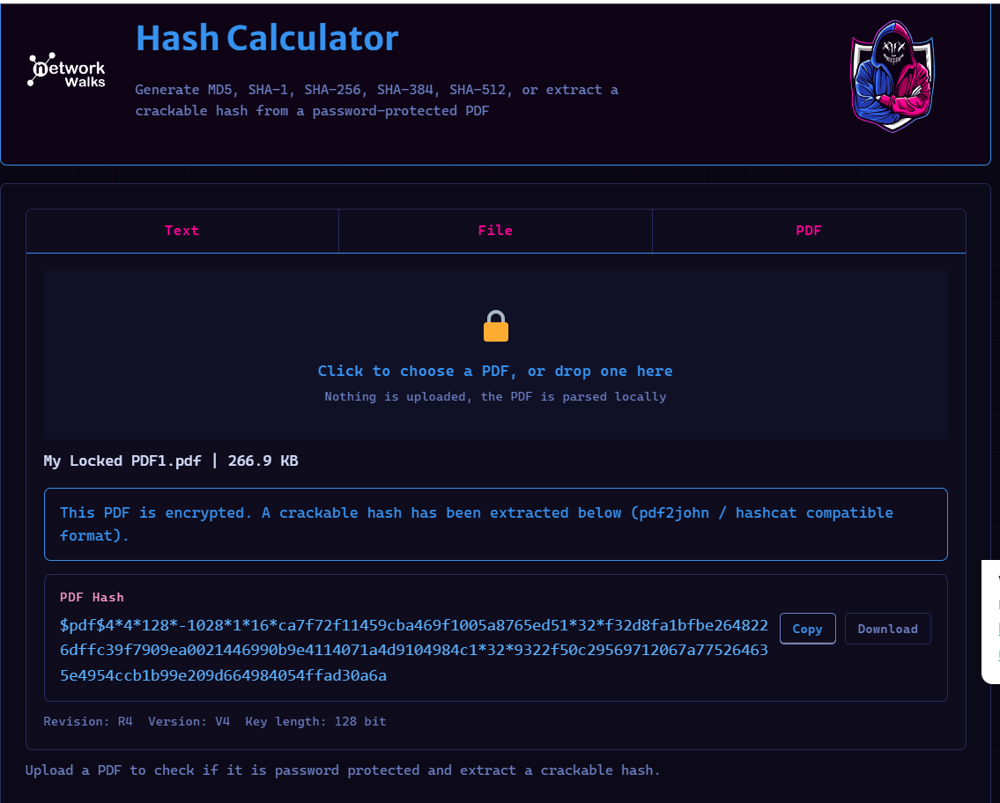

### Saving the Hash
Saved the extracted hash as `hash1.txt` in the project folder.

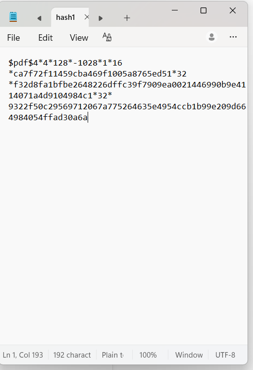

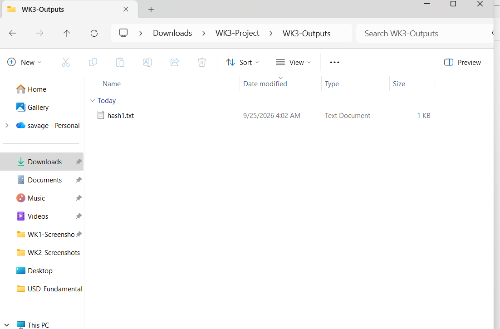

### Loading into Johnny
Loaded the hash file into Johnny. Format detected: **PDF**.

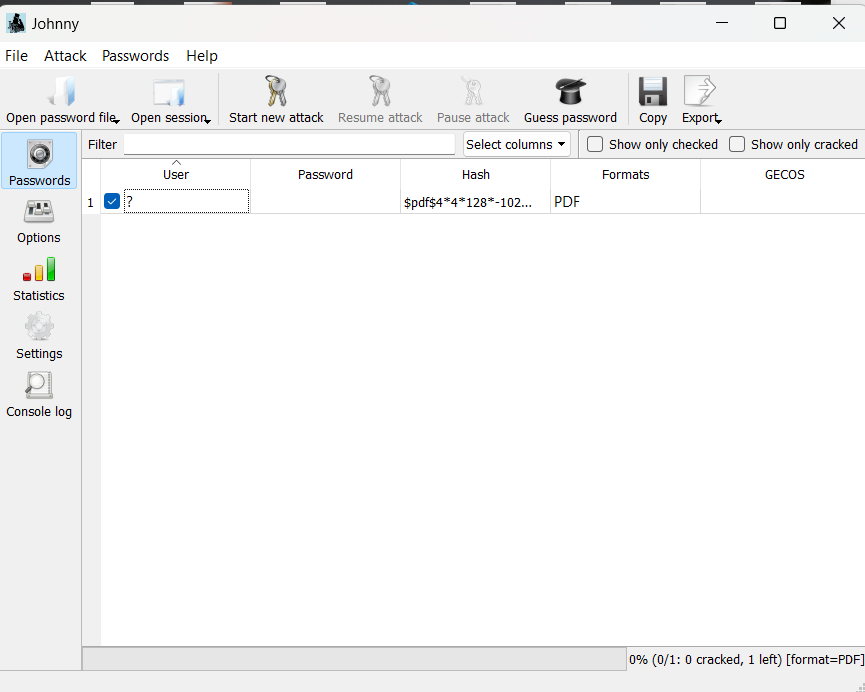

### Result
Johnny cracked the password in under a second:

**Password:** `password1`
**Flag:** `nw{cybersecurity_flag_captured_2608}`

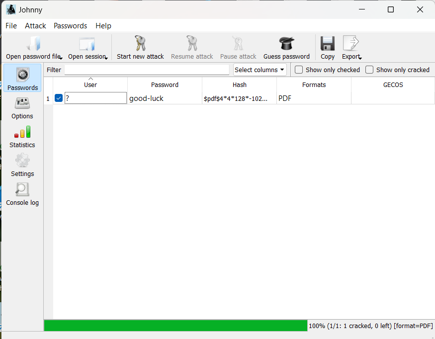

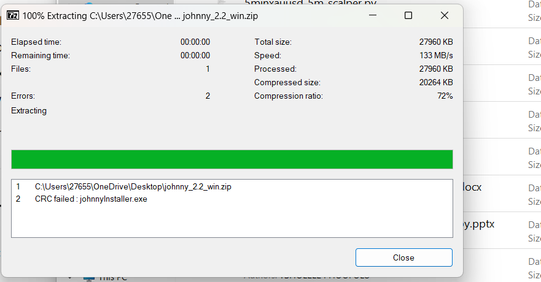

---

## PM2 - Password Cracking with Networkwalks Tools

### Overview
Repeated the process using only browser-based Networkwalks tools.

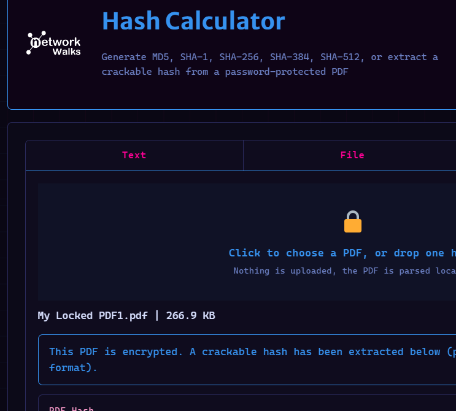

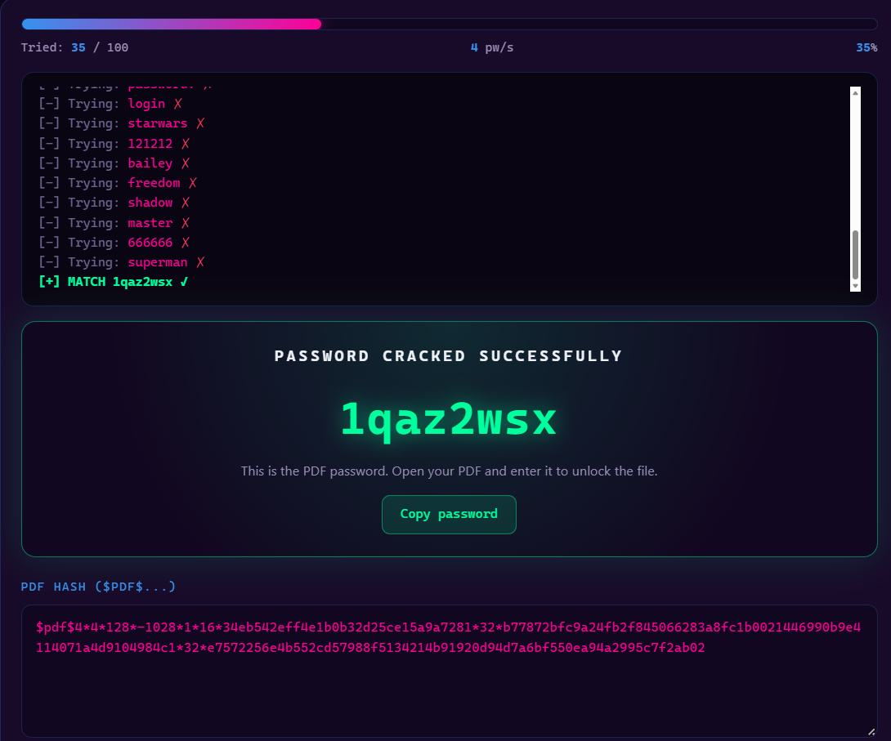

### Result
The built-in 100-word list was exhausted without a match:

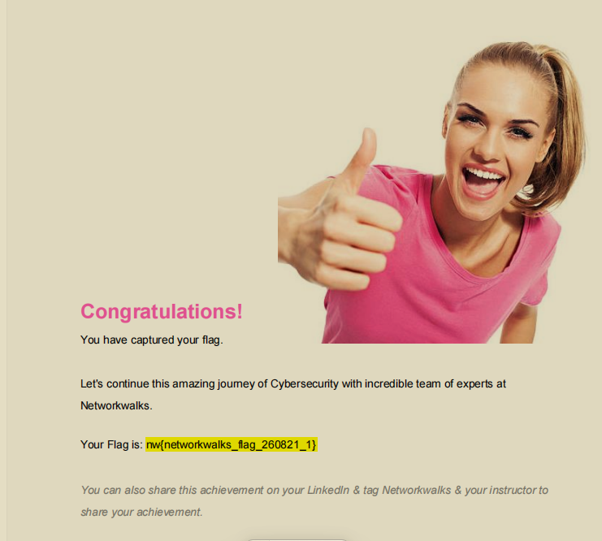

### Analysis
This demonstrates that **cracking success depends on wordlist size**. The same hash was crackable — Johnny succeeded because it used a larger wordlist (`password.lst`). Real-world pentesters use wordlists like `rockyou.txt` (14+ million entries).

---

## Risk Analysis

| # | Finding | Impact | Risk |
|---|---------|--------|------|
| 1 | Password `password1` present in common wordlists | Cracked in seconds | High |
| 2 | PDF hash extractable without the password | Offline attacks possible | High |
| 3 | Small wordlist (100 words) insufficient | Learning point — not a vulnerability | Low |
| 4 | PDF uses slow hash (many iterations) | Brute-force slow, but dictionary still works | Medium |

---

## Recommendations

1. Use **12+ character passwords** with mixed case, numbers, and symbols
2. Avoid predictable patterns (`password1`, `admin123`, `welcome1`)
3. Use a **password manager**
4. Enable **Multi-Factor Authentication (MFA)**
5. Never rely on password protection alone for sensitive files
6. Regular password strength testing with realistic wordlists
7. Use trusted, large wordlists in defensive testing

---

## Conclusion

Week 3 demonstrated the reality of password cracking:

- Dictionary attacks work in seconds against common passwords
- Wordlist size determines cracking success
- Weak passwords are trivially compromised regardless of file format
- Defenders must enforce strong password policies + MFA

**Key lesson:** A password is only as strong as how unlikely it is to appear in a wordlist.

---

## Security & Ethical Use

All activities were performed strictly within the authorized scope of the Networkwalks Cybersecurity Internship (Batch B083). No unauthorized access was attempted. The PDF and lab files were provided by the instructor for educational purposes.

---

## Tags

`#Networkwalks` `#Cybersecurity` `#PasswordCracking` `#JohnTheRipper` `#EthicalHacking` `#InfoSec` `#BatchB083`
